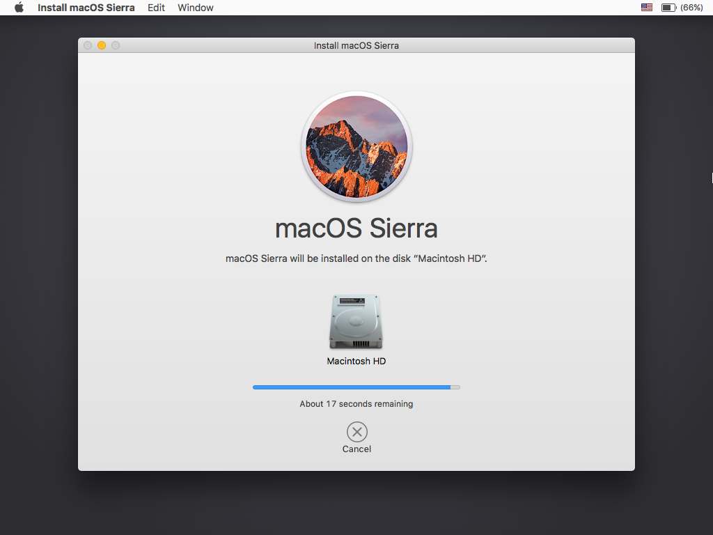
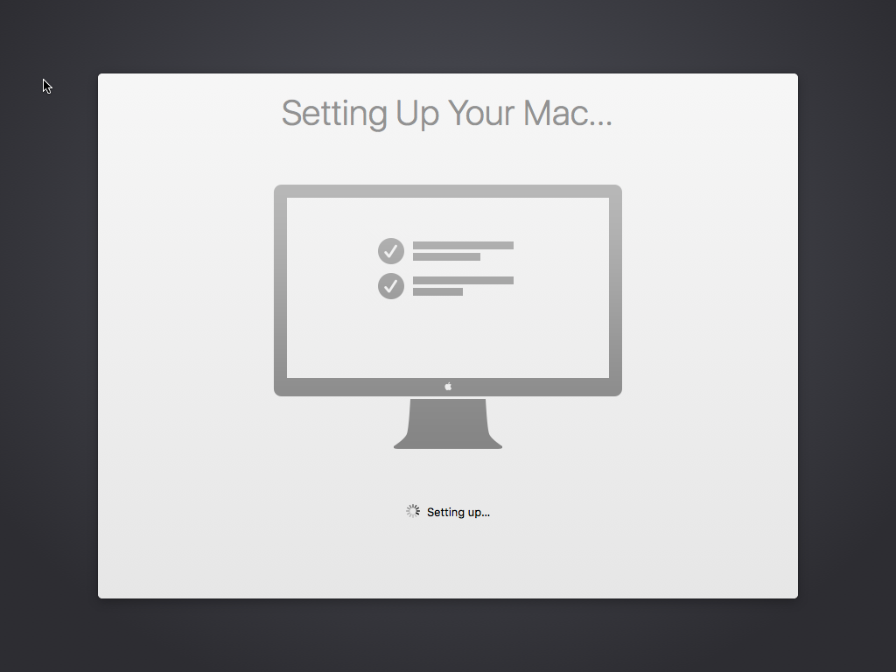
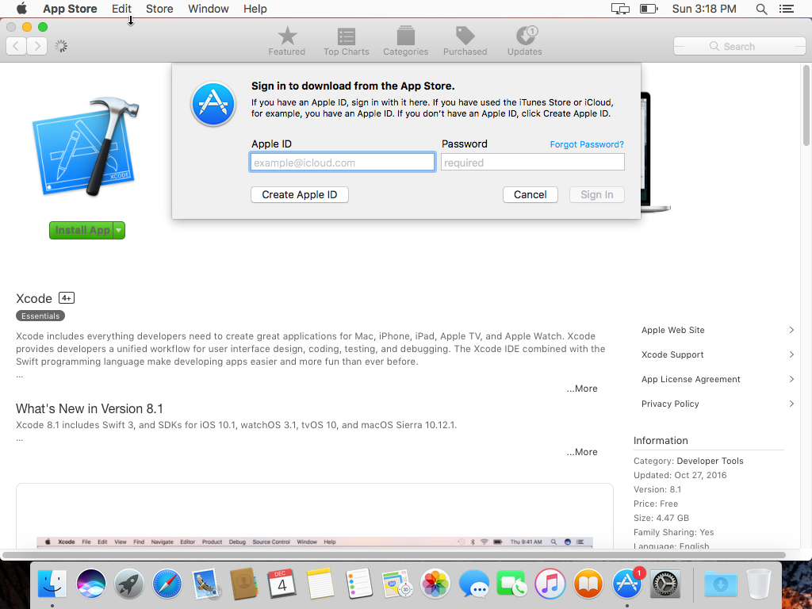
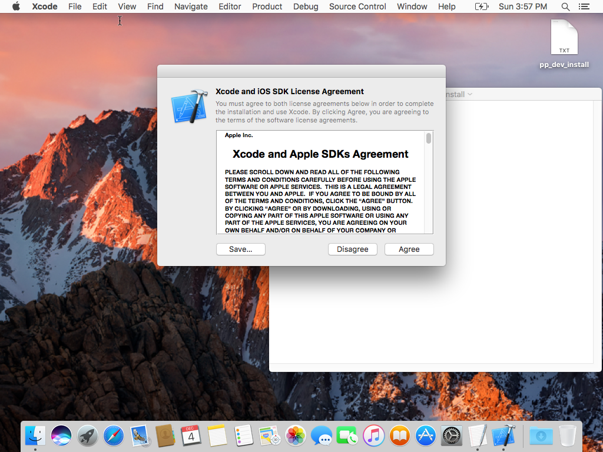
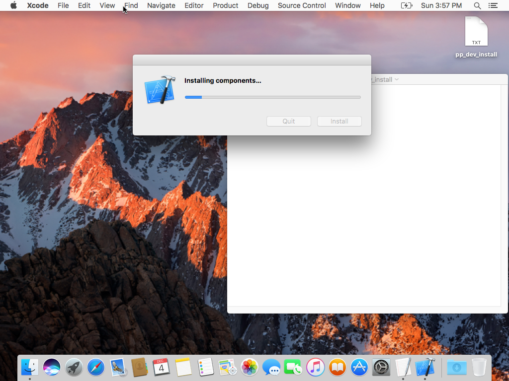
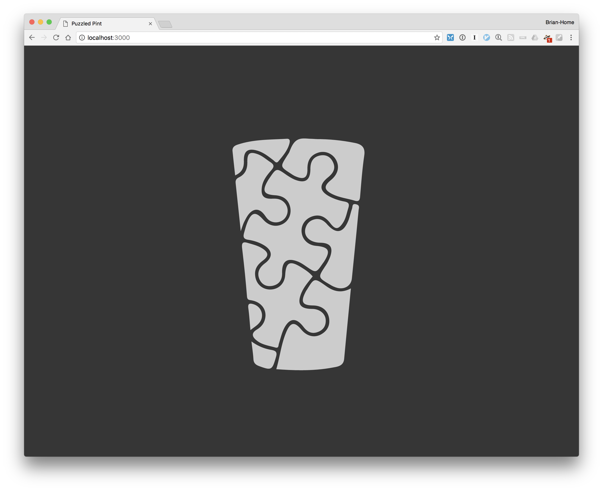

# Overview

This document will take you from a fresh install of macOS to a fully functional development website. It is based on macOS Sierra 10.12.1 and commit hash [6dad816](https://github.com/PuzzledPint/puzzledpint.com/commit/6dad816b13ce0fcbc245b99a1eb4ad6c72318288) (which brought Ruby up to 2.3.1). In the future, your mileage may vary. Other folks, in following similar instructions on their non-fresh-install of macOS, experienced issues along the way. We've tried to document those at the bottom of this page.

## Base OS

This is, quite literally, a bootstrap from a clean OS install.

&nbsp;                          | &nbsp;
------------------------------- | -------------------------------
 | 

## Development Tools

The first thing you will need to do is install Xcode. Do this from the Mac App Store. Even though it is a free application, you will need an App Store login to do so.



Once downloaded and installed, launch Xcode. You will need to agree to the license and let it install its developer components.



Next, install homebrew via <http://brew.sh>. It will instruct you to open a terminal window and paste in a shell command.



Install our Ruby development prerequisites from the same terminal window.

- `brew install postgresql`
- `brew install rbenv`

## Get the Code

Clone the repository: `git clone https://github.com/PuzzledPint/puzzledpint.com.git` but note that your URL may be different if you’re a contributor with ssh access.

- `cd puzzledpint.com`
- `rbenv init`
- Note the given command and add it to your `~/.bash_profile`
- Close and reopen your terminal window so that you get that new environment.
- `rbenv install 2.3.1`
- …wait a very long time…
- `rbenv rehash`
- `gem install bundler`
- `bundle install`

## Set up the Database

- In a new terminal tab, run: `pg_ctl -D /usr/local/var/postgres -l /usr/local/var/postgres/server.log start`
- Back in the original tab, verify that postgres is running and that you can access it:
    - `psql postgres`
    - You should see a `postgres=#` prompt.
    - Ctrl-D to exit
- `./bin/rake db:create`

## Test the Webapp

- `./bin/setup`
- `./bin/rspec`

## Load Sample Data

You might have been given access to a snapshot of production code. If so, you can load that into your database, substituting your specific database dump filename:

`pg_restore --verbose --no-acl --no-owner -h localhost -d puzzled_pint_development pp_prod_dump_20161204`

It is likely that your snapshot is older than the beta code and will require migrations. To be safe, run

```
./bin/rake db:migrate
```

## Launch the Webapp

- `./bin/rails.s` and leave that running
- Open a browser to <http://localhost:3000> and look for the pintglass logo
- Open a browser to <http://localhost:3000/game_control> and log in

TODO: If you do not have a database dump, is there a default username/password?



## Finished Developing

- Ctrl-C in the rails terminal
- `pg_ctl -D /usr/local/var/postgres -l /usr/local/var/postgres/server.log start` in the SQL terminal.


----------


# Issues

## initdb

I ran into two different issues — one that said that /usr/local/var/postgres did not hold a database, and one where (after creating one), creating tables failed due to a mismatch between UTF-8 and ASCII encoding. I fixed this with:

```
initdb -E UTF-8 /usr/local/var/postgres/
```

## Missing Role

I had another problem with a missing role (i.e. login) in the database. I run a unique environment where my day-to-day user does not have macOS adminstrator privileges. I have a separate admin account. When installing postgresql via brew, I used that admin account to do so. This created a role in the database for that account's username, but not my development account's username. I had to create a user role using a set of commands similar to the following (I didn't record specifics, unfortunately).

```
psql postgres
add role with superuser login
Ctrl-D
```


